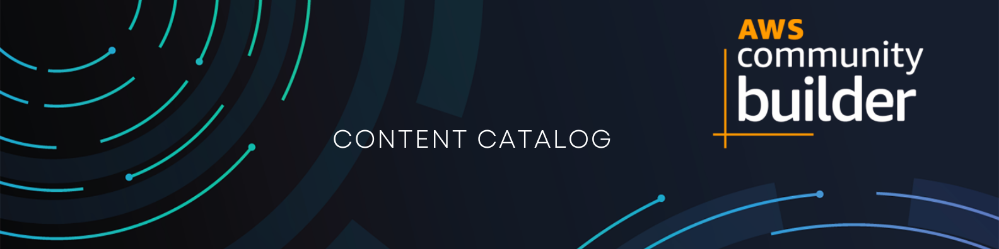

# AWS Community Builders - content catalog

This repository containts link to blogs,
YouTube channels, podcasts, and all
resources builded via
[AWS Community Builders](https://aws.amazon.com/developer/community/community-builders/).

## How to contribute

There is great [gist](https://gist.github.com/olcortesb/788310f20d5191da4880e17544b5db22)
from [Oscar](https://github.com/olcortesb). If you are intrested with contribution,
but have no idea where to start. That is great resource!

## Blogs

- [3sky's notes](https://blog.3sky.dev) -
Blog about DevOps toolchain, and hands on lab. [@3sky](https://github.com/3sky)

- [Bilal's Blog](https://ibilalkayy.hashnode.dev) -
Blog on hashnode [@ibilalkayy](https://github.com/ibilalkayy)

- [Cloud computing blog](https://lepczynski.it/en/) -
AWS, Azure, Kubernetes, Automation. Tips and tutorials.  

- [DANIEL DONBAVAND](https://danieldonbavand.com) -
Transforming AWS Vision into NET Reality [@donbavand](https://github.com/donbavand)

- [Danil Smirnov’s Blog](https://blog.smirnov.la/) -
Blog about DevOps and Cloud Computing.
[@danil-smirnov](https://github.com/danil-smirnov)

- [Jaehyeon Kim's blog](https://jaehyeon.me) -
Blog about data engineering. [@jaehyeon-kim](https://github.com/jaehyeon-kim)

- [Last Week in AWS](https://www.lastweekinaws.com/blog/) -
Last Week in AWS. [@QuinnyPig](https://github.com/QuinnyPig)

- [Lays’s on the Clouds](https://lays147.substack.com) -
TALK ABOUT AWS, SOFTWARE ARCHITECTURE AND MORE! [@lays147](https://github.com/lays147)

- [Piyush Sachdeva's blog on Medium](https://medium.com/@piyush.sachdeva055) -
Blog about AWS/Azure/GCP and DevOps [@piyushsachdeva](https://github.com/piyushsachdeva)

- [Ran the Builder](https://www.ranthebuilder.cloud) -
A blog dedicated to AWS Serverless & Lambda 101 [@ran-isenberg](https://github.com/ran-isenberg)

- [Rishab in Cloud](https://blog.rishabkumar.com) -
Blog on hashnode [@rishabkumar7](https://github.com/rishabkumar7)

- [lockhead.info](https://lockhead.info) -
A blog about CI/CD, DevOps and AWS technology [@Lock128](https://github.com/Lock128)

- [olcortesb](https://olcortesb.hashnode.dev/) -
A blog focus on serverless in general  [@olcortesb](https://github.com/olcortesb)

- [Security and Cloud 24/7](https://security-24-7.com) -
Information Security and Cloud Blog
[eyalestrin](https://github.com/eyalestrin)

- [The Serverless Terminal](https://www.theserverlessterminal.com/) -
Everything AWS, Serverless and Architectures [@zachjonesnoel](https://github.com/zachjonesnoel)

- [Binaryheap](https://binaryheap.com) -
A blog about about tech, programming, AWS, Serverless.
[@benbpyle](https://github.com/benbpyle)

- [Pawel Piwosz' space on dev.to](https://dev.to/pawelpiwosz) -
DevOps, Cloud, processes, CI/CD and much more [@pawelpiwosz](https://github.com/pawelpiwosz)

- [Tech wth Durgadas](https://tech.durgadas.in/) -
Development, AWS, Serverless and Tutorials [@imdurgadas](https://github.com/imdurgadas)

- [Road to AWS](https://roadtoaws.com/) -
Road to AWS - This is my cloud journey
[@suhajda3](https://github.com/suhajda3)

- [Alexander Hose](https://alexanderhose.com/) -
Let's make the cloud more secure • The Cloud Security Blog ⛅ [@AlexanderHose](https://github.com/AlexanderHose)

## Newsletters

- [AWS Weekly](https://awsweekly.info) -
Weekly wrap-up of AWS public releases. [@mskutin](https://github.com/mskutin)

- [Last Week in AWS](https://www.lastweekinaws.com/newsletter) -
Last Week in AWS. [@QuinnyPig](https://github.com/QuinnyPig)

- [Let's make Cloud](https://letsmakecloud.beehiiv.com) -
Expert-curated news and insights about Cloud,
DevOps & Architecture trends. [@theonlymonica](https://github.com/theonlymonica)

- [Newsletter by 3sky.dev](https://newsletter.3sky.dev) -
Probably your favorite newsletter about Dev and Ops. [@3sky](https://github.com/3sky)

- [Simple AWS - by Guille Ojeda](https://www.simpleaws.dev) -
Master AWS with Real-World Solutions and Best Practices.
[@guilleojeda](https://github.com/guilleojeda)

## Podcasts

- [Last Week in IT](https://rss.com/podcasts/lastweekinit/) -
A weekly podcast hosted by Pawel Piwosz.
[@pawelpiwosz](https://github.com/pawelpiwosz)

- [DevOps In Agile Way](https://rss.com/podcasts/devopsinagileway/) -
Yet another weekly podcast hosted by Pawel Piwosz.
[@pawelpiwosz](https://github.com/pawelpiwosz)

- [Logicast by Logicata](https://logicastvideo.podbean.com) -
A weekly podcast hosted by Karl Robinson, and Jon Goodall.

## YouTube channels

- [chinwee__o](https://www.youtube.com/@chinwee__o) -
Things related to working in tech,
tools and technologies relevant for a
career as a data analyst, as well as tutorials.
[chinweeee](https://github.com/chinweeee)

- [cicdonaws](https://www.youtube.com/@cicdonaws/) -
Level up your software development with CI/CD
best practices, templates and tips & tricks! [@Lock128](https://github.com/Lock128)

- [Open Up The Cloud](https://www.youtube.com/c/OpenUpTheCloud) -
Videos to help people start and grow a career in cloud.
Created by [Lou](https://twitter.com/loujaybee)

- [Cloud Tuner](https://www.youtube.com/@cloudtuner) -
AWS Refresher Quiz - AWS CLOUD related quiz which
may be used to practice for AWS Certification Exams
AWS Catch the Concept - Short vidoes focusing
on various concepts related to system design and AWS
and many more videos about AWS Concepts which will
help to dive into aws. [@nandinivijay](https://github.com/nandinivijay)

- [ibilalkayy](https://www.youtube.com/@ibilalkayy) -
Valuable content related to programming. [@ibilalkayy](https://github.com/ibilalkayy)

- [InfiniteLinux](https://www.youtube.com/@InfiniteLinux) -
In-depth tutorials and demos on the latest
technologies in the field, including Terraform,
Kubernetes, Docker, Linux, and AWS.
[Tariq Siddiqui](https://www.linkedin.com/in/tariqsiddiqui/)

- [rishabkumar7](https://www.youtube.com/@rishabkumar7) -
I am passionate about helping people get
into cloud and sharing my learnings from my
time in cloud, DevOps and now Developer Relations.
[@rishabkumar7](https://github.com/rishabkumar7)

- [TechTutorialswithPiyush](https://www.youtube.com/@TechTutorialswithPiyush) -
Amazing hands-on projects and tutorial about cloud computing(AWS,Azure,GCP),
DevOps, Kubernetes, and the latest trends in the IT industry.

- [techwithhelen](https://www.youtube.com/@techwithhelen) - Simplifying DevOps/Cloud!

- [WojciechLepczynski](https://www.youtube.com/@WojciechLepczynski) -
Tutorials, tips and much more mainly in the
field of cloud and automation.

- [DevOps in the Cloud](https://www.youtube.com/@lastweekinit) -
The name still needs to be adjusted :) Currently podcasts,
more intertesting content hopefuly soon.
[@pawelpiwosz](https://github.com/pawelpiwosz)

## Webpages

- [Scaled CI/CD framework](https://www.cicd.run/) -
CI/CD design framework to use in all phases of creating and maintain the CI/CD
[@pawelpiwosz](https://github.com/pawelpiwosz)

- [Durgadas Kamath](https://www.youtube.com/@durgadaskamath) -
Tech videos curated throug experience in the field of AWS.
Serverless, Developer Experience, Architecture Patterns and many more.
